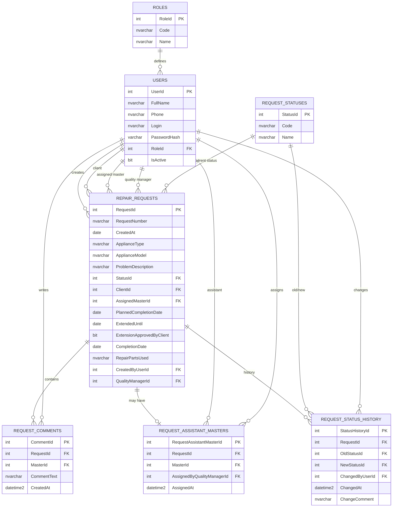

# ER-диаграмма

```mermaid
erDiagram
    ROLES ||--o{ USERS : "defines"
    USERS ||--o{ REPAIR_REQUESTS : "creates"
    USERS ||--o{ REPAIR_REQUESTS : "client"
    USERS ||--o{ REPAIR_REQUESTS : "assigned master"
    USERS ||--o{ REPAIR_REQUESTS : "quality manager"
    REQUEST_STATUSES ||--o{ REPAIR_REQUESTS : "current status"
    REPAIR_REQUESTS ||--o{ REQUEST_COMMENTS : "contains"
    USERS ||--o{ REQUEST_COMMENTS : "writes"
    REPAIR_REQUESTS ||--o| REQUEST_ASSISTANT_MASTERS : "may have"
    USERS ||--o{ REQUEST_ASSISTANT_MASTERS : "assistant"
    USERS ||--o{ REQUEST_ASSISTANT_MASTERS : "assigns"
    REPAIR_REQUESTS ||--o{ REQUEST_STATUS_HISTORY : "history"
    REQUEST_STATUSES ||--o{ REQUEST_STATUS_HISTORY : "old/new"
    USERS ||--o{ REQUEST_STATUS_HISTORY : "changes"

    ROLES {
        int RoleId PK
        nvarchar Code
        nvarchar Name
    }

    USERS {
        int UserId PK
        nvarchar FullName
        nvarchar Phone
        nvarchar Login
        varchar PasswordHash
        int RoleId FK
        bit IsActive
    }

    REQUEST_STATUSES {
        int StatusId PK
        nvarchar Code
        nvarchar Name
    }

    REPAIR_REQUESTS {
        int RequestId PK
        nvarchar RequestNumber
        date CreatedAt
        nvarchar ApplianceType
        nvarchar ApplianceModel
        nvarchar ProblemDescription
        int StatusId FK
        int ClientId FK
        int AssignedMasterId FK
        date PlannedCompletionDate
        date ExtendedUntil
        bit ExtensionApprovedByClient
        date CompletionDate
        nvarchar RepairPartsUsed
        int CreatedByUserId FK
        int QualityManagerId FK
    }

    REQUEST_COMMENTS {
        int CommentId PK
        int RequestId FK
        int MasterId FK
        nvarchar CommentText
        datetime2 CreatedAt
    }

    REQUEST_ASSISTANT_MASTERS {
        int RequestAssistantMasterId PK
        int RequestId FK
        int MasterId FK
        int AssignedByQualityManagerId FK
        datetime2 AssignedAt
    }

    REQUEST_STATUS_HISTORY {
        int StatusHistoryId PK
        int RequestId FK
        int OldStatusId FK
        int NewStatusId FK
        int ChangedByUserId FK
        datetime2 ChangedAt
        nvarchar ChangeComment
    }
```

