# Краткая спецификация

## Назначение

Приложение автоматизирует учет заявок на ремонт бытовой техники в сервисном центре `ООО "БытСервис"`.

## Входные данные

- учетные данные пользователя
- данные заявки: тип техники, модель, описание проблемы, клиент, статус
- назначение ответственного мастера
- комментарии мастера
- сведения о деталях и материалах
- данные о продлении срока ремонта и согласовании с клиентом

## Выходные данные

- список заявок с текущими статусами
- карточка заявки
- комментарии по ремонту
- статистика по выполненным заявкам
- QR-код для формы оценки качества
- SQL-отчеты по ремонту и загрузке мастеров

## Основной алгоритм

```mermaid
flowchart TD
    A["Авторизация пользователя"] --> B{"Роль подтверждена?"}
    B -- "Нет" --> C["Сообщение об ошибке"]
    B -- "Да" --> D["Загрузка доступных заявок"]
    D --> E["Поиск / просмотр / открытие карточки"]
    E --> F{"Какое действие выбрано?"}
    F -- "Новая заявка" --> G["Проверка обязательных полей"]
    F -- "Редактирование" --> H["Изменение статуса, мастера, описания"]
    F -- "Комментарий" --> I["Добавление комментария мастера"]
    F -- "Контроль качества" --> J["Продление срока и привлечение мастера"]
    G --> K["Сохранение в БД"]
    H --> K
    I --> K
    J --> K
    K --> L["Обновление истории статусов и статистики"]
```

## Детализация функции расчета среднего времени ремонта

1. Отобрать заявки, у которых заполнена дата завершения.
2. Для каждой заявки вычислить разницу между `CompletionDate` и `CreatedAt` в днях.
3. Просуммировать полученные значения.
4. Разделить сумму на количество завершенных заявок.
5. Вывести среднее значение в интерфейс статистики и в SQL-отчет.

