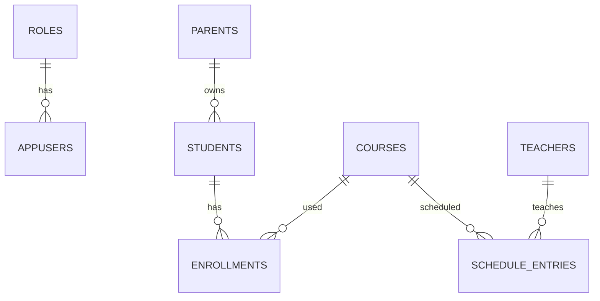

# ER Diagram

```mermaid
erDiagram
    ROLES ||--o{ APPUSERS : has
    PARENTS ||--o{ STUDENTS : owns
    COURSES ||--o{ ENROLLMENTS : used
    STUDENTS ||--o{ ENROLLMENTS : has
    TEACHERS ||--o{ SCHEDULE_ENTRIES : teaches
    COURSES ||--o{ SCHEDULE_ENTRIES : scheduled
```
